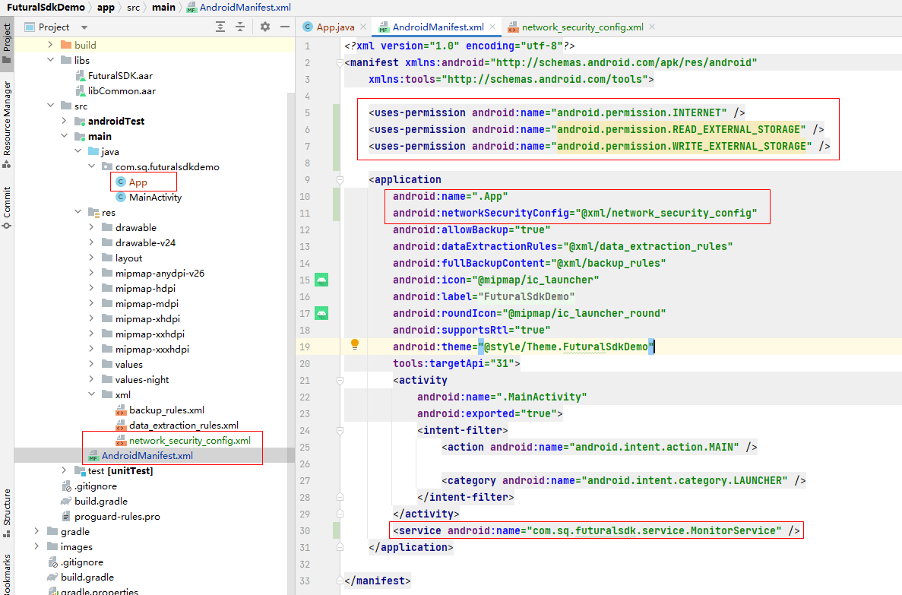

### SDK usage instructions
1. Import aar files and dependent projects
    
2. Add application permissions, App subcategories, network configurations and import services
    
---
### API usage instructions
After the robot is started successfully, when the app starts the MonitorService, the MonitorService will communicate with the lower computer and send out a FuturalConstants.ROS_READY broadcast, indicating that the robot is in the ready state.
1. Battery information - after the robot is successfully started, the current battery percentage can be obtained through the following API
```
    FuturalUtils.getPowerLevel()
```
2. Charging status - After the robot is successfully started, the following API can be used to obtain whether the robot is charging.
```
    FuturalUtils.isCharging() true indicates that the robot is charging
```
3. Emergency stop status -- after the robot is successfully started, the emergency stop status can be obtained through the following API
```
    FuturalUtils.getEmergence() true indicates that the emergency stop key is pressed
```
4. Braking status -- after the robot is successfully started, the following API can obtain the braking status
```
    FuturalUtils.getBrake() true indicates that the brake button is pressed
```
5. Positioning quality--after the robot is started successfully, the following API can obtain the positioning quality and return int type data, ranging from 0-100. The larger the value, the more accurate the positioning. When the value is less than 50, when navigating to a certain point, The greater the chance of error
```
    FuturalUtils.getLocalizationQuality()
```
6. Obtain point information of the current map
```
    String jsonStr = FuturalUtils.getCurrentMapPointsInfo()
    List<PoisBean> positions = JSON.parseObject(jsonStr, new TypeReference<List<PoisBean>>() {});
```
7. Go to a certain point through coordinate navigation
```
    private ActionResultBean actionResultBean;
    private FuturalAPIUtils.ActionCallBack actionCallBack = new SlamAPIUtils.ActionCallBack() {
        @Override
        public void onResponse(ActionResultBean bean) {
            actionResultBean = bean;//Save it and use it when querying the navigation status
        }

        @Override
        public void onFailure() {
        }
    };

    PoisBean.PoseBean poseBean = new PoisBean.PoseBean();
    poseBean.setX(oriX);
    poseBean.setY(oriY);
    poseBean.setYaw(theta);
    FuturalAPIUtils.createMoveToAction(actionCallBack, poseBean);
```
8. Query navigation status
```
    FuturalAPIUtils.checkAction((new SlamAPIUtils.ActionCallBack() {
        @Override
        public void onResponse(ActionResultBean bean) {
            Log.e(TAG, "checkAction, " + bean);
            if (isCanceling || handler.getActivity().isDestroyed()) return;

            //In some cases, the action id will be reset by the chassis, causing the check to always return 404, and the robot will stop at a certain point and not move. In this case, navigate to a certain point again.
            if (bean.getAction_id() == -404) {
                //Please call the API to navigate to a certain point again
            } else if (bean != null && bean.getState().getStatus() == 4 && bean.getState().getResult() == 0) {
                Log.d(TAG, "arrived point");
            } else {
                //If you do not arrive at the specified location, please check again
            }
        }
        @Override
        public void onFailure() {
        }
    }), actionResultBean.getAction_id());
```
9. Cancel navigation
```
    FuturalAPIUtils.cancelCurrentAction(new FuturalAPIUtils.ActionCallBack() {
        @Override
        public void onResponse(ActionResultBean bean) {
            Log.e(TAG, "cancelNav");
        }

        @Override
        public void onFailure() {
        }
    });
    Simply call FuturalAPIUtils.cancelCurrentAction(null);
```